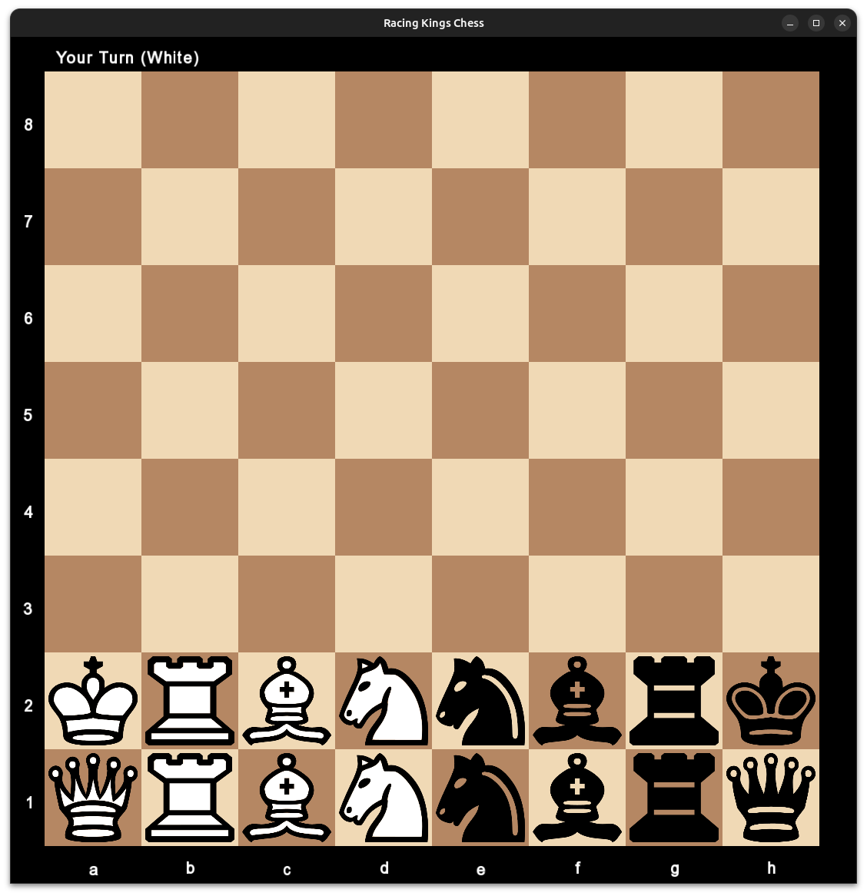

# Racing Kings Chess AI

  

This is a racing kings chess ai. I was building it in a university project a few years ago. It was originally written in c. Now i added a cpp gui around it to make it usable again. A good expanation for racing kings chess is given at [lichess.org](https://lichess.org/variant/racingKings).

## Usage

Clone the project via the following command.

`git clone --recurse-submodules https://github.com/Tobiasloch/rkchess-minimax-ai`

The project contains submodules. Therefore you have to use `--recurse-submodules`.

Run `make` to compile the code. The binary is then in `./bin/rkchess`. To get information on how to use it run `./bin/rkchess --help`.
